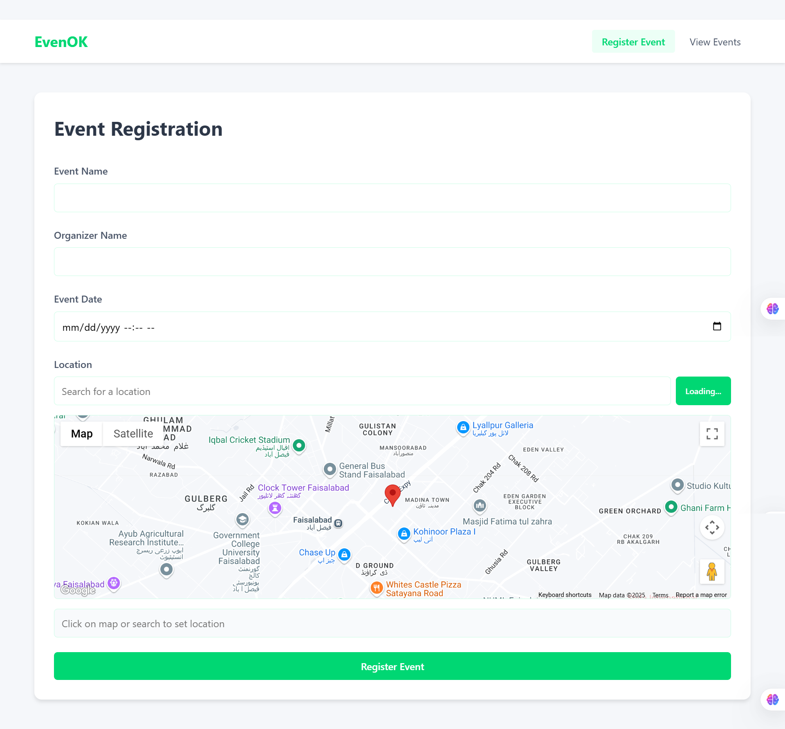
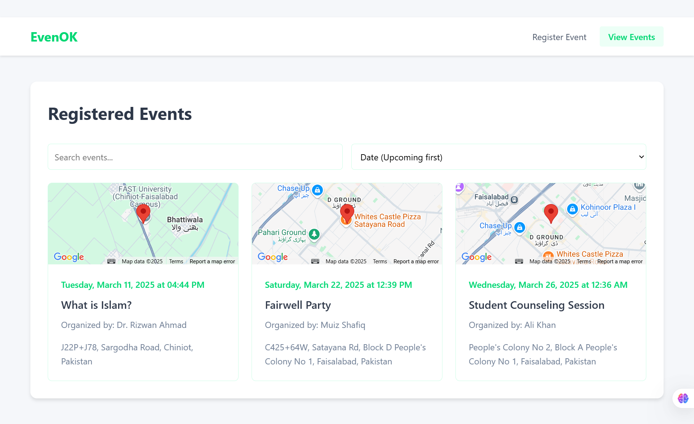

# EvenOK - Event Registration App

## Overview
EvenOK is an event registration application that allows users to:
- **Register Events**: Enter event details including name, organizer, date, and location.
- **Interact with Google Maps**: Select a location using the map, search with autocomplete, or use your current location.
- **View Events**: Browse all registered events with filtering and sorting options.

## Features
- **Google Maps Integration**: Powered by the [Google Maps JavaScript API](https://developers.google.com/maps/documentation/javascript/overview).
- **Location Search & Autocomplete**: Find locations easily using a search bar.
- **Current Location**: Utilize your device's geolocation to choose your default location.
- **Real-time Feedback**: Toast notifications for errors and successes.
- **Event Filtering & Sorting**: Search events by name, organizer, or address and sort by date or name.
- **Responsive Design**: Optimized for both desktop and mobile browsers.

## Technologies Used
- [Node.js](https://nodejs.org/)
- [Express](https://expressjs.com/)
- [MongoDB](https://www.mongodb.com/) with [Mongoose](https://mongoosejs.com/)
- [Google Maps JavaScript API](https://developers.google.com/maps/)
- HTML, CSS, JavaScript

## Installation

1. **Clone the repository**
    ```sh
    git clone <repository-url>
    cd Event_Registration_AKA_GoogleMapAPI
    ```

2. **Install dependencies**
    ```sh
    npm install
    ```

3. **Create a `.env` file**
    Ensure you have a `.env` file in the project root with the following variables:
    ```env
    MONGODB_URI=mongodb+srv://<username>:<password>@<cluster-address>/event-registration
    PORT=3000
    GOOGLE_MAPS_API_KEY=YOUR_GOOGLE_MAPS_API_KEY
    ```

4. **Run the application**
    - For production:
        ```sh
        npm start
        ```
    - For development with hot-reloading:
        ```sh
        npm run dev
        ```

## Usage

1. **Access the Application**
   Open your browser and navigate to [http://localhost:3000](http://localhost:3000).

2. **Register an Event**
   - Fill in the event name, organizer name, and event date.
   - Use the integrated Google Map to set the event location by either:
     - Clicking on the map,
     - Searching for a location using the autocomplete search bar, or
     - Using the “My Location” button to select your current location.
   - Submit the form to register the event.

3. **View Registered Events**
   - Click the **View Events** tab in the navigation bar.
   - Use filtering and sorting options to easily browse through the event listings.

## Project Structure
```
├── .env                   # Environment variables
├── .gitignore             # Files to be ignored by Git
├── index.js               # Main server application (Express setup)
├── package.json           # Project configuration and dependencies
├── models/
│   └── Event.js           # Mongoose schema for events ([models.Event](f:/uni-work/6thSemester/WEB_ENGINEERING/WebLab/LAB_9/Event_Registration_AKA_GoogleMapAPI/models/Event.js))
├── pages/
│   └── index.html         # Main HTML file ([pages/index.html](f:/uni-work/6thSemester/WEB_ENGINEERING/WebLab/LAB_9/Event_Registration_AKA_GoogleMapAPI/pages/index.html))
├── static/
│   ├── script.js          # Client-side JavaScript ([static/script.js](f:/uni-work/6thSemester/WEB_ENGINEERING/WebLab/LAB_9/Event_Registration_AKA_GoogleMapAPI/static/script.js))
│   └── style.css          # CSS styles ([static/style.css](f:/uni-work/6thSemester/WEB_ENGINEERING/WebLab/LAB_9/Event_Registration_AKA_GoogleMapAPI/static/style.css))
└── README.md              # This file
```

## API Endpoints
- **GET /**  
  Serves the main HTML page.

- **POST /api/events**  
  Create a new event.  
  _Request body example:_
  ```json
  {
      "eventName": "Music Concert",
      "organizerName": "John Doe",
      "date": "2023-12-31T20:00",
      "location": {
          "lat": 40.7128,
          "lng": -74.0060,
          "address": "New York, NY, USA"
      }
  }
  ```

- **GET /api/events**  
  Retrieve all registered events.

## Screenshots



## Troubleshooting

- **MongoDB Connection Issues**:  
  Ensure your `MONGODB_URI` in the `.env` file is correct and your MongoDB Atlas cluster is properly configured.

- **Google Maps Not Loading**:  
  Verify that your `GOOGLE_MAPS_API_KEY` is valid and has proper permissions.

## License
This project is licensed under the [MIT License](https://opensource.org/licenses/MIT).

## Acknowledgements
- [Google Maps API](https://developers.google.com/maps/)
- [Express.js](https://expressjs.com/)
- [MongoDB Atlas](https://www.mongodb.com/cloud/atlas)
```// filepath: